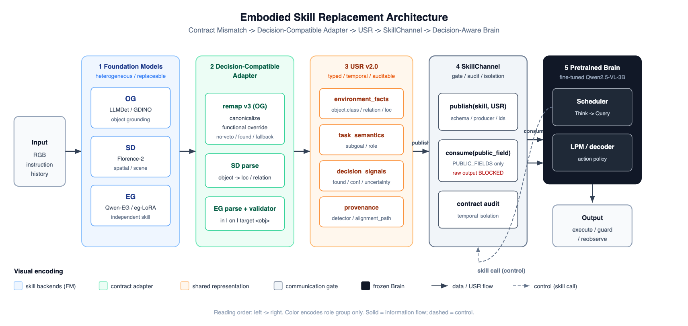

<div align="center">

# RoboAgent-CVPR26-USR

### Embodied Skill Replacement

**Contract Mismatch → Decision-Compatible Adapter → USR → SkillChannel → Decision-Aware Training**

<br/>

[Architecture](#skill-architecture)
·
[Results](#main-results)
·
[Evaluation](#evaluation-protocols)
·
[Findings](#core-findings)
·
[Docs](#research-docs)
·
[Reproduce](#reproduction-notes)

<br/>


</div>

<br/>

Frozen experimental code for replacing specialized Foundation Model (FM) skill modules inside a pretrained embodied agent (**RoboAgent**, fine-tuned **Qwen2.5-VL-3B**) while keeping the Brain's contract intact.

> **Pre-optimization frozen snapshot** (commit `c1663fe4`).  
> Subsequent optimization experiments live on the `topconf-contract-evolution` branch.

---

## Highlights

- **Contract mismatch is the failure mode.** Naive FM replacement collapses performance; a Decision-Compatible Adapter recovers it.
- **Align recovers the Brain.** Exact McNemar (Align vs Naive): **p < 0.001**, **23 recovered**, **0 regression**.
- **USR unifies heterogeneous skills.** Typed / temporal / auditable representation with explicit decision signals.
- **SkillChannel enforces the contract.** Whitelist consume, raw-output blocked, **12/12** contract tests.
- **Decision-aware training works.** DA-FT decision accuracy **98%** (172/175); signal-sensitive **34/35**.

---

## Skill Architecture

The framework turns heterogeneous Foundation Models into **pluggable Embodied Skills** that communicate with the pretrained Brain through a **Unified Skill Representation (USR)** gated by a **SkillChannel**.

<p align="center">
  
</p>

<p align="center">
  <sub>
    Solid arrows = data / USR flow &nbsp;·&nbsp; Dashed arrow = control (<code>skill call</code>) &nbsp;·&nbsp;
    <a href="assets/skill-architecture.svg">SVG source</a>
  </sub>
</p>

<details>
<summary><strong>Stage-by-stage legend</strong> (same information as the figure)</summary>

<br/>

| Stage | What it is | Key contents |
|------:|------------|--------------|
| 0 | **Input** | RGB / instruction / history |
| 1 | **Foundation Models** | OG: LLMDet / Grounding DINO · SD: Florence-2 · EG: Qwen-EG / eg-LoRA |
| 2 | **Decision-Compatible Adapter** | remap v3 (canonicalize / functional override / no-veto / found / fallback); SD parse; EG parse + validator |
| 3 | **USR v2.0** | `environment_facts` · `task_semantics` · `decision_signals` · `provenance` |
| 4 | **SkillChannel** | `publish(skill, USR)` · `consume(skill, public_field)` [whitelist] · contract audit · temporal isolation · raw BLOCKED |
| 5 | **Pretrained Brain** | Scheduler (Think → Query) + LPM; `consume` feeds both; skill call returns to SkillChannel |
| 6 | **Output** | execute / guard / reobserve |

</details>

### Role of each layer

| Layer | Responsibility | Evidence |
|-------|----------------|----------|
| **Foundation Models** | heterogeneous, replaceable skill backends | OG=LLMDet/GDINO, SD=Florence-2, EG=independent |
| **Skill Logic + Adapter** | convert raw FM output into Brain-compatible contract | naive 34% → aligned 80% |
| **USR** | typed, temporal, auditable shared representation | 100% OG→USR→SD propagation, no raw bypass |
| **SkillChannel** | publish/consume gate + contract audit + raw-leak isolation | 12/12 contract tests |
| **Brain** | consumes USR facts + decision signals | DA-FT 98% counterfactual accuracy |

---

<a id="main-results"></a>

## Main Results

**Setup:** EB-ALFRED base · **50 episodes** · seed **42**

| Config | Meaning | SR | GCR |
|--------|---------|:---:|:---:|
| Native | RoboAgent native | **78%** | 0.78 |
| Naive | GDINO direct replace, no adapter | **34%** | 0.34 |
| **Align** | GDINO + Decision-Compatible Adapter | **80%** | 0.80 |
| Align+USR | Align + USR Channel | 78% | 0.78 |
| **FullIndep** | OG + independent EG-LoRA + SD + USR | **80%** | 0.80 |

| Metric | Result |
|--------|--------|
| Exact McNemar (Align vs Naive) | **p < 0.001** · 23 recovered · 0 regression |
| DA-FT decision accuracy | **98%** (172/175) · signal-sensitive **34/35** |
| Skill-aware ablation | canonical **48%** / canonical+signals **61%** / flat-USR **58%** / shuffled-USR **28%** |
| SkillChannel contract tests | **12/12** |

---

## Problem

When a heterogeneous FM (e.g., Grounding DINO, LLMDet) replaces a skill module (e.g., object grounding) of a pretrained embodied agent:

| # | Challenge | Why it matters |
|:-:|-----------|----------------|
| 1 | **Contract mismatch** | FM output does not match the Brain's expected contract (vocabulary, format, semantics) |
| 2 | **Naive replacement** | Causes catastrophic degradation |
| 3 | **Multi-skill plumbing** | Skills need a unified, typed, auditable communication channel |
| 4 | **Decision signals** | Brain must consume `found` / `confidence` / `uncertainty`, not only object labels |

---

## Evaluation Protocols

All numbers are computed from **per-episode manifests** (never hand-filled).

| Artifact | Contents |
|----------|----------|
| `run_manifest.json` | git commit / model SHA-256 / prompt hash / seed / episode ids |
| `episode_manifest.jsonl` | per-episode GCR / SR |

<details open>
<summary><strong>1. Exact McNemar (Align vs Naive)</strong> — p &lt; 0.001 · 23 recovered · 0 regression</summary>

<br/>

- **Dataset**: EB-ALFRED base, 50 episodes, seed 42, same Brain (fine-tuned Qwen) / generation config.
- **Pairing**: for each episode, compare Align-SR vs Naive-SR on the **same episode**.
- **Discordant pairs** (exact McNemar):
  - `b` = Naive fails, Align succeeds = **23**
  - `c` = Align fails, Naive succeeds = **0**
- **Test**: two-sided exact binomial McNemar `p = 2·P(Binomial(b+c, 0.5) ≤ min(b,c))` → `p ≈ 2.4e-7 < 0.001`.
- `regression` = success→fail (Naive→Align) = 0; `improvement` = fail→success = 23.
- **Failure taxonomy**: of 33 Naive-failed episodes, 22/23 recovered show `lpm_error` (OG detection succeeds but label mismatches Brain contract → wrong downstream action). Dominant mode = downstream contract mismatch (4× `contract_mismatch`, 3× `detection_failure`, 26× `lpm_error_unknown`).

</details>

<details>
<summary><strong>2. DA-FT decision accuracy</strong> — 98% (172/175) · 34/35 signal-sensitive</summary>

<br/>

- **Data**: 35 real EB cases from traces; for each case, **RGB / target / history / OG object.class / context are FIXED**; only USR `found / confidence / uncertainty` vary.
- **5 signal states × 35 cases = 175 probes**:

  | state | USR | expected policy |
  |-------|-----|-----------------|
  | high-conf | `found=true; confidence=0.90` | execute |
  | low-conf | `found=true; confidence=0.15` | guard (no-op) |
  | found=false | `found=false; confidence=0.00` | reobserve |
  | missing-conf | `found=true` (no conf) | execute |
  | conflict | `found=false; confidence=0.90` | reobserve |

- **Brains compared**: Base (40%), raw-FT (40%, same action for all states — 0/35 sensitive), DA-FT (decision-aware trained).
- **DA-FT metrics**: decision accuracy = 172/175 = **98%**; signal-sensitivity = **34/35**; reobserve F1 = 0.98; risk-coverage = high-conf 35/35 execute, low-conf 0/35 execute.
- **Per-case log**: `USR → Brain input → raw output → parsed action → expected policy` for every probe.

</details>

<details>
<summary><strong>3. Skill-aware training ablation</strong> — 48 / 61 / 58 / 28</summary>

<br/>

- **Data**: 350 clean-class OG samples × 650 identical supervision rows per variant (350 normal + 150 reobserve + 150 guard). **Same** pool / split / sample count / epochs(4) / batch(6) / lr(2e-4) / optimizer steps / checkpoint init / evaluation set.
- **Only difference = input representation**:

  | variant | input |
  |---------|-------|
  | raw | object class only |
  | canonical | object class only |
  | canonical+signals | class + `found/confidence` |
  | flat-USR | class + `found/confidence` (USR-style) |
  | shuffled-USR | class + **randomized** `found/confidence` |

- **Metric (unseen-FM)**: action-list exact match on 200 held-out **GDINO** OG test rows.
- **Counterfactual (5 states)**: only canonical+signals / flat-USR reach 5/5; raw/canonical 2/5.
- **Interpretation**: shuffled-USR collapse (28%) shows the model learned *signal→decision*, not USR serialization; gain comes from explicit decision signals (canonical+signals ≈ flat-USR).

</details>

<details>
<summary><strong>4. SkillChannel contract tests</strong> — 12/12</summary>

<br/>

- **publish** validates: schema_version / required sections / producer / episode_id / step_id / timestamp.
- **consume** restricted to `PUBLIC_FIELDS` whitelist; raw fields (`det_query`, bbox, caption, model-specific output) are **blocked**.

  | # | test | behavior |
  |---|------|----------|
  | 1 | missing required field | reject |
  | 2 | wrong type | reject |
  | 3/3b | confidence &lt;0 or &gt;1 | reject |
  | 4 | wrong schema version | reject |
  | 5 | stale message (step &lt; current) | reject |
  | 6 | **cross-episode** message | reject |
  | 7 | wrong producer | recorded (audit) |
  | 8 | **future-step** message (temporal leakage) | reject |
  | 8b | sequential step | accept |
  | 9 | unknown field (non-whitelist) | blocked |
  | 10/10b | raw model-output leakage | detected + isolated |

- Every call emits a machine-readable audit record: `producer / consumer / episode_id / step_id / schema_version / fields_consumed / fields_blocked / validation_result`.

</details>

---

## Core Findings

1. **Contract Mismatch + Decision-Compatible Adapter** is the primary performance contribution: naive **34% → aligned 80%** (+46pp). In audited failures, the dominant mode is downstream contract mismatch (OG detection succeeds, but the label does not match the Brain contract → wrong downstream action).

2. **USR** provides a typed / temporal / auditable unified interface. Behavioral gain is attributable primarily to **explicit decision signals** (canonical+signals **61%** ≈ flat-USR **58%**), not USR serialization itself.

3. **Decision-aware training** enables the Brain to consume decision signals: DA-FT **98%** counterfactual accuracy vs raw-FT **40%**.

---

## Research Docs

Advisor-requested surveys archived in this repo:

| Doc | Topic | One-line answer |
|-----|-------|-----------------|
| [`RESEARCH_SOTA_SURVEY.md`](RESEARCH_SOTA_SURVEY.md) | SOTA embodied agents / FM-as-Skill / training / benchmarks | RoboAgent sits between “pure-action VLA” and “LLM-orchestrated skills” |
| [`RESEARCH_BRAIN_DECISION_TRAINING.md`](RESEARCH_BRAIN_DECISION_TRAINING.md) | Does baseline FT-Qwen train the decision part? | Trains scheduler + LPM + canonical vocab, but **no decision-signal supervision**; data/code not released |
| [`RESEARCH_MODULE_SKILL_COMPOSITION.md`](RESEARCH_MODULE_SKILL_COMPOSITION.md) | How do split skills connect to the Brain? | Adapter (align) + USR (unify) + SkillChannel (validate) + decision-aware training |

Combined summary: [`INVESTIGATION_RESPONSE.md`](INVESTIGATION_RESPONSE.md)

---

## Repository Layout

```text
RoboAgent-CVPR26-USR/
├── agents/                  # Brain + skills + USR + SkillChannel
│   ├── agent.py             # scheduler + 7 skills + USR Channel hooks
│   ├── og_remap_only.py     # Decision-Compatible Adapter (remap v3)
│   ├── usr.py               # USR construction / ablation
│   ├── usr_channel.py       # SkillChannel publish/consume + audit
│   ├── eg_*_backend.py      # EG backends (LLM / LoRA / adapter / explore)
│   ├── florence2_sd.py      # Florence-2 SD backend
│   └── …                    # registries, manifests, detectors, prompts
├── runners/                 # EB-ALFRED + ALFWorld runners
├── run_ebalf.py             # EB-ALFRED evaluation entry
├── run_aw.py                # ALFWorld evaluation entry
├── eval_config.yaml
└── assets/skill-architecture.{png,svg}
```

<details>
<summary><strong>Full agents/ file list</strong></summary>

<br/>

```text
agents/
├── agent.py                 # RoboAgent agent: scheduler + 7 skills + USR Channel hooks
├── og_remap_only.py         # Decision-Compatible Adapter (remap v3) for OG
├── eg_llm_backend.py        # EG text-LLM backend + validator
├── eg_lora_backend.py       # Independent EG-LoRA skill backend
├── eg_adapter_backend.py    # EG Skill Logic + Adapter (Base Qwen)
├── eg_explore_backend.py    # ExploreVLM-style EG (Base Qwen variants)
├── usr.py                   # Unified Skill Representation construction/ablation
├── usr_channel.py           # SkillChannel: publish/consume + contract audit + raw-leak guard
├── usr_og_backend.py        # OG → USR backend (decision-equivalent to remap v3)
├── usr_sd_eg.py             # SD/EG → USR parse + round-trip
├── usr_reliability.py       # USR schema/type/missing/conflict validation
├── usr_og_adapter.py        # OG USR adapter
├── contract_adapter.py      # Contract adapter (canonical/functional)
├── skill_alignment.py       # canonicalize + functional override
├── detector_registry.py     # detector registry (LLMDet / GDINO)
├── model_registry.py        # model registry (skill+variant → path/hash)
├── run_manifest.py          # run manifest (git/hash/config/episode tracking)
├── florence2_sd.py          # Florence-2 SD backend
├── sd_florence_cascade.py   # SD cascade
├── llmdet_og.py / llmdet_qwen_og.py / naive_detector.py / og_cascade_gated*.py
├── skill_memory.py / skill_interface.py / stage0_utils.py
└── prompt_aw.py / prompt_ebalf.py
```

</details>

---

## Reproduction Notes

| Item | Detail |
|------|--------|
| **Environment** | AI2-THOR (`thor-201909061227`) via EmbodiedBench · Python 3.12 · torch 2.8.0 · transformers 4.57.0 · RTX 6000D |
| **Brain** | fine-tuned Qwen2.5-VL-3B (RoboAgent_CVPR26, frozen) |
| **Data** | EB-ALFRED base (50 ep) · ALFWorld `eval_out_of_distribution` (134 ep) |
| **Weights** | Not included (large binaries). See `FINAL_MODEL_MANIFEST.json` in the frozen archive for paths + SHA-256 |

### Frozen Archive

Read-only snapshot of the full project (code + runs + training data + checkpoints + SHA256SUMS) lives under `frozen_final_closure_<TS>/` on the experiment machine. All final numbers in this README are computed from per-episode manifests.

---

## References / Related Work

| Work | Role in this repo |
|------|-------------------|
| **RoboAgent (CVPR 2026)** | single fine-tuned Qwen2.5-VL-3B as unified embodied Brain |
| **Grounding DINO / LLMDet** | open-vocabulary object detectors (OG backends) |
| **Florence-2** | prompt-based unified vision model (SD backend) |
